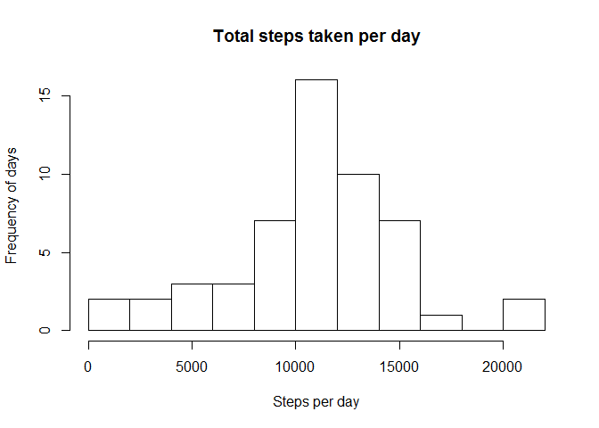
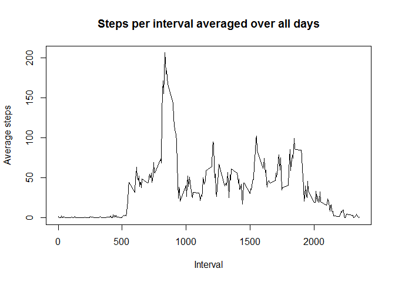
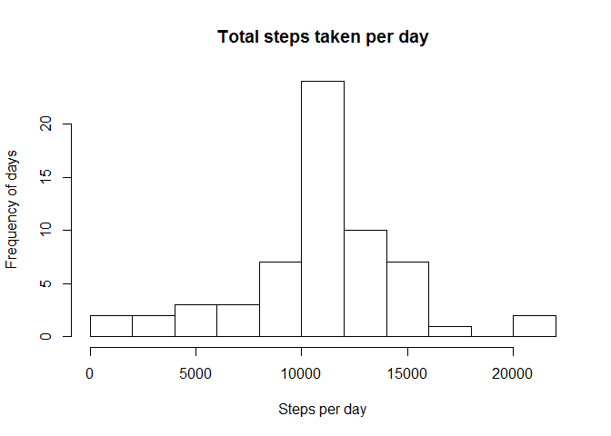
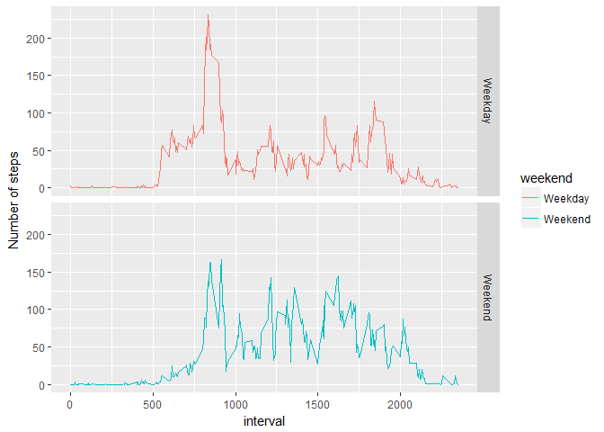

# Reproducible Research: Peer Assessment 1

## Introduction

It is now possible to collect a large amount of data about personal
movement using activity monitoring devices such as a
[Fitbit](http://www.fitbit.com), [Nike
Fuelband](http://www.nike.com/us/en_us/c/nikeplus-fuelband), or
[Jawbone Up](https://jawbone.com/up). These type of devices are part of
the "quantified self" movement -- a group of enthusiasts who take
measurements about themselves regularly to improve their health, to
find patterns in their behavior, or because they are tech geeks. But
these data remain under-utilized both because the raw data are hard to
obtain and there is a lack of statistical methods and software for
processing and interpreting the data.

This assignment makes use of data from a personal activity monitoring
device. This device collects data at 5 minute intervals through out the
day. The data consists of two months of data from an anonymous
individual collected during the months of October and November, 2012
and include the number of steps taken in 5 minute intervals each day.

## Data

The data for this assignment can be downloaded from the course web
site:

* Dataset: [Activity monitoring data](https://d396qusza40orc.cloudfront.net/repdata%2Fdata%2Factivity.zip) [52K]

The variables included in this dataset are:

* **steps**: Number of steps taking in a 5-minute interval (missing
    values are coded as `NA`)

* **date**: The date on which the measurement was taken in YYYY-MM-DD
    format

* **interval**: Identifier for the 5-minute interval in which
    measurement was taken


The dataset is stored in a comma-separated-value (CSV) file and there
are a total of 17,568 observations in this
dataset.

## Loading and preprocessing the data
Let's load the data in the activity data frame and convert the dates to POSIXct format for later use.  

1. Load the data (i.e. read.csv())  

```r
activity <- read.csv("activity.csv")
```

2. Process/transform the data (if necessary) into a format suitable for your analysis

```r
activity$date <- as.POSIXct(activity$date)
```

## What is mean total number of steps taken per day?

1. Make a histogram of the total number of steps taken each day  

```r
daily <- aggregate(steps ~ date, activity, sum)
hist(daily$steps,xlab="Steps per day",ylab="Frequency of days",main="Total steps taken per day",breaks = 10)
```

<!-- -->

2. Calculate and report the mean and median total number of steps taken per day  

```r
meanAct <- mean(daily$steps,na.rm=T)
medianAct <- median(daily$steps,na.rm=T)
cat("The mean of daily steps taken is",meanAct)
```

```
## The mean of daily steps taken is 10766.19
```

```r
cat("\nThe median of daily steps taken is",medianAct)
```

```
## 
## The median of daily steps taken is 10765
```

## What is the average daily activity pattern?

1. Make a time series plot (i.e. type = "l") of the 5-minute interval (x-axis) and the average number of steps taken, averaged across all days (y-axis)

```r
avgByInterval <- aggregate(steps  ~ interval, activity, mean,rm.na=T)
maxStepsInterval <- max(avgByInterval$steps)
maxInterval <- avgByInterval[which.max(avgByInterval$steps),"interval"]
with(avgByInterval,plot(interval,steps,type="l",xlab="Interval",ylab="Average steps",main="Steps per interval averaged over all days"))
```

<!-- -->


2. Which 5-minute interval, on average across all the days in the dataset, contains the maximum number of steps?

```r
cat("\nThe 5-minute interval with the maximum steps, on average across all days in the data set, is interval",maxInterval,"with",maxStepsInterval,"steps on average.")
```

```
## 
## The 5-minute interval with the maximum steps, on average across all days in the data set, is interval 835 with 206.1698 steps on average.
```

## Imputing missing values

1. Calculate and report the total number of missing values in the dataset (i.e. the total number of rows with NAs)

```r
nasum <- sum(is.na(activity))
cat("\nThe number of missing values in the data set is",nasum)
```

```
## 
## The number of missing values in the data set is 2304
```

2. Devise a strategy for filling in all of the missing values in the dataset. The strategy does not need to be sophisticated. For example, you could use the mean/median for that day, or the mean for that 5-minute interval, etc.  
    *Observing the data showed me that there are certain days where all data is missing. This led me to decide to impute the missing values with the average steps for those intervals over all days in the data.*
    
3. Create a new dataset that is equal to the original dataset but with the missing data filled in.

```r
imputedActivity <- activity
imputedActivity$steps[is.na(imputedActivity$steps)] <- avgByInterval$steps
```

4. Make a histogram of the total number of steps taken each day and Calculate and report the mean and median total number of steps taken per day. Do these values differ from the estimates from the first part of the assignment? What is the impact of imputing missing data on the estimates of the total daily number of steps?  
    *While it may appear to be the same at fist glance, the middle column is much higher.  This is because we imputed averages into the missing data causing everything to center on the mean.*
    

```r
ImpDaily <- aggregate(steps ~ date, imputedActivity, sum)
hist(ImpDaily$steps,xlab="Steps per day",ylab="Frequency of days",main="Total steps taken per day",breaks = 10)
```

<!-- -->

```r
meanImpAct <- mean(ImpDaily$steps,na.rm=T)
medianImpAct <- median(ImpDaily$steps,na.rm=T)
cat("\nThe mean of daily steps taken after imputing data is",meanImpAct)
```

```
## 
## The mean of daily steps taken after imputing data is 10766.19
```

```r
cat("\nThe median of daily steps taken after imputing data is",medianImpAct)
```

```
## 
## The median of daily steps taken after imputing data is 10766.19
```

## Are there differences in activity patterns between weekdays and weekends?
*There is an obvious increaes to the average activity level on the weekend as compared to that of the weekdays.*  

1. Create a new factor variable in the dataset with two levels -- "weekday" and "weekend" indicating whether a given date is a weekday or weekend day.


```r
imputedActivity$weekday <- weekdays(imputedActivity$date)
imputedActivity$weekend[(imputedActivity$weekday=="Saturday"|imputedActivity$weekday=="Sunday")] <- "Weekend"
imputedActivity$weekend[(imputedActivity$weekday!="Saturday"&imputedActivity$weekday!="Sunday")] <- "Weekday"
impAvgInterval <- aggregate(steps ~ interval + weekend, imputedActivity, mean,rm.na=T)
```

2. Make a panel plot containing a time series plot (i.e. type = "l") of the 5-minute interval (x-axis) and the average number of steps taken, averaged across all weekday days or weekend days (y-axis).


```r
library(ggplot2)
q <- qplot(interval,steps,data=impAvgInterval,facets = weekend~.,geom="line",color=weekend,xlab="interval",ylab="Number of steps")
print(q)
```

<!-- -->
